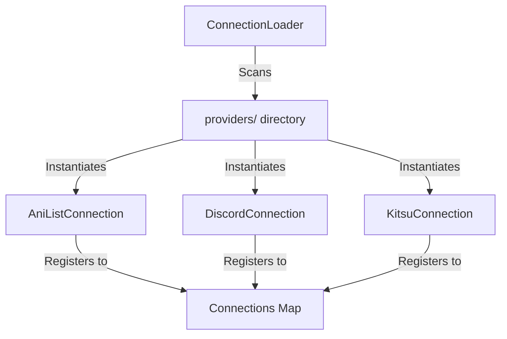

# Adding a New Connection Provider to Runa

This guide explains the step-by-step process of adding a new connection provider (such as OAuth2 login or media trackers) to the Runa platform.

---

## Architecture Overview

Connections are loaded dynamically at runtime via the `ConnectionLoader`. The loader scans the `packages/connections/src/providers/` directory for any classes extending the `BaseConnection` class, instantiates them, and registers them using their `providerKey`.



---

## Step-by-Step Guide

### Step 1: Update the Database Schema

First, register the new connection provider inside the Prisma database schema.

1. Open `packages/database/schema.prisma`
2. Add your provider key (in uppercase) to the `ConnectionProvider` enum:

```prisma
enum ConnectionProvider {
    ANILIST
    MAL
    SIMKL
    DISCORD
    KITSU
    MY_NEW_PROVIDER  // <-- Add your new provider here
}
```

3. Run the following command from the root directory to regenerate the Prisma Client types:
```bash
pnpm --filter @runa/database db:generate
```

---

### Step 2: Implement the Connection Class

Create a new connection provider file under `packages/connections/src/providers/my-new-provider.connection.ts`. Your class must inherit from `BaseConnection` and implement all abstract methods.

Here is the boilerplate structure:

```typescript
import { ConnectionProvider, ConnectionLinkedTo } from "@runa/database";
import { BaseConnection } from "../base-connection.js";
import { ConnectionCapability } from "../metadata.js";
import { AnimeUpdateData } from "../types.js";

export default class MyNewProviderConnection extends BaseConnection {
  // 1. Must match the enum value in schema.prisma
  public readonly providerKey = ConnectionProvider.MY_NEW_PROVIDER;

  // 2. Client credentials required in process.env to enable this provider
  public readonly requiredEnvKeys = ["MY_NEW_PROVIDER_CLIENT_ID", "MY_NEW_PROVIDER_CLIENT_SECRET"];

  // 3. Declare capabilities supported by this provider
  public readonly capabilities = [
    ConnectionCapability.AUTH,
    ConnectionCapability.SHOWCASE,
  ];

  // 4. Generate the OAuth authorization URL
  public getAuthUrl(token: string, redirectUrl?: string): string {
    const clientId = this.deps.env.MY_NEW_PROVIDER_CLIENT_ID;
    const redirectUri = `${this.deps.apiUrl}/connections/my-new-provider/callback`;
    const url = new URL("https://example.com/oauth/authorize");
    url.searchParams.append("client_id", clientId!);
    url.searchParams.append("redirect_uri", redirectUri);
    url.searchParams.append("response_type", "code");
    const state = redirectUrl ? `${token}:::${redirectUrl}` : token;
    url.searchParams.append("state", state);

    return url.toString();
  }

  // 5. Handle authorization callback, token exchange, profile retrieval, and upsert to database
  public async handleCallback(code: string, username: string): Promise<{ success: boolean }> {
    const clientId = this.deps.env.MY_NEW_PROVIDER_CLIENT_ID;
    const clientSecret = this.deps.env.MY_NEW_PROVIDER_CLIENT_SECRET;
    const redirectUri = `${this.deps.apiUrl}/connections/my-new-provider/callback`;

    // Exchange code for token
    const tokenRes = await fetch("https://example.com/oauth/token", {
      method: "POST",
      headers: { "Content-Type": "application/json" },
      body: JSON.stringify({
        grant_type: "authorization_code",
        client_id: clientId,
        client_secret: clientSecret,
        code,
        redirect_uri: redirectUri,
      }),
    });

    if (!tokenRes.ok) throw new Error("Token exchange failed");
    const tokens = await tokenRes.json();

    // Fetch user profile info
    const profileRes = await fetch("https://example.com/api/profile", {
      headers: { Authorization: `Bearer ${tokens.access_token}` },
    });
    if (!profileRes.ok) throw new Error("Profile fetch failed");
    const profile = await profileRes.json();

    // Upsert into connection table
    await this.deps.prisma.client.connections.upsert({
      where: {
        username_provider: { username, provider: ConnectionProvider.MY_NEW_PROVIDER },
      },
      update: {
        linkedUsername: profile.username,
        accessToken: tokens.access_token,
        connectionId: String(profile.id),
        linkedTo: ConnectionLinkedTo.AQUILA,
      },
      create: {
        username,
        provider: ConnectionProvider.MY_NEW_PROVIDER,
        linkedUsername: profile.username,
        accessToken: tokens.access_token,
        connectionId: String(profile.id),
        linkedTo: ConnectionLinkedTo.AQUILA,
      },
    });

    return { success: true };
  }

  // 6. Optional: Implement capability syncing/delete handlers if applicable (e.g. Anime/Manga)
  public async updateAnimeEntry(username: string, providerId: number, data: AnimeUpdateData): Promise<void> {
    // Custom sync logic here
  }
}
```

---

### Step 3: Configure Provider Metadata

Next, register your new provider's display metadata in `packages/connections/src/metadata.ts`. This metadata is consumed directly by the frontend to render the user interface.

1. Open `packages/connections/src/metadata.ts`
2. Add an entry to the `PROVIDERS_METADATA` array:

```typescript
  {
    id: "my-new-provider", // Matches provider ID in lowercase
    name: "My New Provider",
    description: "Connect to sync your activity dynamically.",
    url: "https://example.com",
    icon: "https://example.com/favicon.png",
    accentColor: "bg-[#00bcd4]/10 border-[#00bcd4]/20 text-[#00bcd4] hover:bg-[#00bcd4]/20",
    glowColor: "shadow-[#00bcd4]/10",
    capabilities: [ConnectionCapability.AUTH, ConnectionCapability.SHOWCASE],
    
    // Optional: If supporting media search capabilities
    async search(query: string, type: "ANIME" | "MANGA"): Promise<ConnectionSearchResult[]> {
      const res = await fetch(`https://example.com/api/search?q=${encodeURIComponent(query)}`);
      const data = await res.json();
      return (data.results || []).map((item: any) => ({
        id: item.id.toString(),
        title: item.title,
        image: item.image_url,
      }));
    }
  }
```

---

### Step 4: Write Unit Tests

Ensure that your provider is correctly detected and loaded:

1. Open `packages/connections/src/__tests__/connection-loader.spec.ts`
2. Mock your provider's credentials under `mockDeps.env`:
```typescript
      env: {
        // ... existing credentials
        MY_NEW_PROVIDER_CLIENT_ID: "mock-id",
        MY_NEW_PROVIDER_CLIENT_SECRET: "mock-secret",
      }
```
3. Update expectations to assert that the loader dynamically detects the new class and matches the correct size:
```typescript
    expect(loaded.size).toBe(6); // Incremented size
    expect(loaded.has(ConnectionProvider.MY_NEW_PROVIDER)).toBe(true);
```

---

## Showcase: Kitsu Integration Walkthrough

The **Kitsu** integration provides a solid showcase of a complete media-syncing connection implementing `SHOWCASE`, `ANIME`, and `MANGA` capabilities:

### 1. Kitsu Connection Class (`kitsu.connection.ts`)
See how Kitsu checks for existing library entries (`getLibraryEntry`) and decides to create a new entry with `POST` or update an existing one with `PATCH` matching the **JSON:API** standard:

```typescript
const existing = await this.getLibraryEntry(conn.accessToken, conn.connectionId, "anime", providerId);

if (existing) {
  // Update with PATCH
  await fetch(`https://kitsu.io/api/edge/library-entries/${existing.id}`, {
    method: "PATCH",
    headers,
    body: JSON.stringify({
      data: { id: existing.id, type: "libraryEntries", attributes }
    })
  });
} else {
  // Create with POST using relationships
  await fetch("https://kitsu.io/api/edge/library-entries", {
    method: "POST",
    headers,
    body: JSON.stringify({
      data: {
        type: "libraryEntries",
        attributes: { status: status || "planned", ...attributes },
        relationships: {
          user: { data: { type: "users", id: conn.connectionId } },
          media: { data: { type: "anime", id: String(providerId) } }
        }
      }
    })
  });
}
```

### 2. Kitsu Search implementation (`metadata.ts`)
Using Kitsu's public JSON:API endpoint, search converts the raw data to the standard `ConnectionSearchResult` format:

```typescript
    async search(query: string, type: "ANIME" | "MANGA"): Promise<ConnectionSearchResult[]> {
      const path = type.toLowerCase();
      const res = await fetch(
        `https://kitsu.io/api/edge/${path}?filter[text]=${encodeURIComponent(query)}&page[limit]=10`,
        {
          headers: {
            "Accept": "application/vnd.api+json",
            "Content-Type": "application/vnd.api+json",
          }
        }
      );
      const json = await res.json();
      return (json.data || []).map((item: any) => {
        const attr = item.attributes || {};
        return {
          id: item.id.toString(),
          title: attr.canonicalTitle || attr.english || attr.romaji,
          image: attr.posterImage?.tiny || attr.posterImage?.small,
          format: attr.subtype || attr.showType,
          episodes: attr.episodeCount,
          chapters: attr.chapterCount,
        };
      });
    }
```
